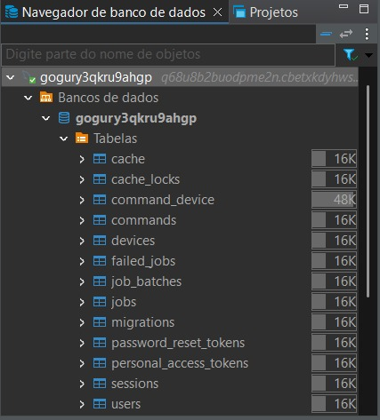
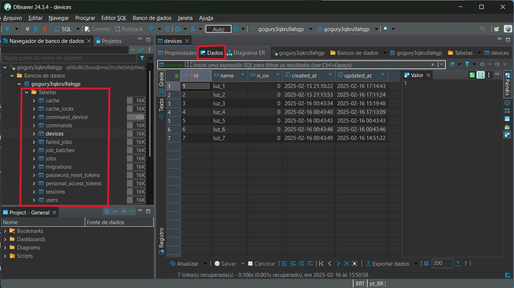

# Projeto de Controle de Componentes com Raspberry Pi Pico W

Este projeto consiste em um sistema de controle de componentes utilizando um Raspberry Pi Pico W. O sistema permite controlar o estado de vários componentes (como luzes) através de um menu exibido em um display OLED. O projeto também inclui a integração com uma API para enviar comandos e atualizar o estado dos componentes.

## Requisitos de Hardware

- **Raspberry Pi Pico W**
- **Display OLED (SSD1306)**
- **Botões para controle (SW, BTN_B, BTN_SAIR)**
- **Joystick**

## Requisitos de Software

- **IDE para desenvolvimento em C** (por exemplo, Visual Studio Code com extensão para Pico)
- **SDK do Raspberry Pi Pico**
- **Bibliotecas necessárias:**
  - `pico/stdlib.h`
  - `hardware/i2c.h`
  - `ssd1306.h`
  - `hardware/adc.h`
  - `hardware/pwm.h`
  - `hardware/timer.h`
  - `pico/cyw43_arch.h`
  - `lwip/pbuf.h`
  - `lwip/tcp.h`
  - `lwip/dns.h`

## Instalação do dBeaver

Para facilitar a gestão de bancos de dados durante o desenvolvimento, é recomendado instalar o dBeaver, uma ferramenta de gerenciamento de banco de dados multiplataforma.

1. **Baixe o dBeaver**:
   - Acesse o site oficial do dBeaver: [https://dbeaver.io/download/](https://dbeaver.io/download/).
   - Escolha a versão adequada para o seu sistema operacional e faça o download.

2. **Instale o dBeaver**:
   - Siga as instruções de instalação fornecidas no site.

---

# Guia para Configurar uma Conexão com o Banco de Dados no dBeaver

Após instalar e executar o dBeaver, siga os passos abaixo para configurar uma nova conexão com o banco de dados MySQL utilizado no projeto.

## Passo a Passo para Configurar a Conexão

1. **Abra o dBeaver**:
   - Execute o dBeaver no seu computador. Ele abrirá diretamente a tela de gerenciamento de conexões.

2. **Criar uma Nova Conexão**:
   - Na tela inicial, clique no ícone **"Nova Conexão"** (geralmente representado por um símbolo de banco de dados com um "+").
   - Uma janela de seleção de banco de dados será aberta.

3. **Selecionar o Tipo de Banco de Dados**:
   - Na lista de bancos de dados disponíveis, escolha **MySQL** e clique em **"Avançar"**.

4. **Preencher as Credenciais do Banco de Dados**:
   - Na próxima tela, você verá campos para preencher as informações de conexão. Insira os seguintes dados:
     - **Host**: `q68u8b2buodpme2n.cbetxkdyhwsb.us-east-1.rds.amazonaws.com`
     - **Porta**: `3306`
     - **Banco de dados**: `gogury3qkru9ahgp`
     - **Usuário**: `lb3fg1ms2z18n3fv`
     - **Senha**: `vtw9hdzeuoxeul7o`

5. **Testar a Conexão**:
   - Após preencher os campos, clique no botão **"Testar Conexão"**.
   - Se houver dependências ou drivers necessários que não estejam instalados, o dBeaver solicitará que você os baixe. Aceite e aguarde a instalação.
   - Se a conexão for bem-sucedida, uma mensagem de sucesso será exibida.

6. **Finalizar a Configuração**:
   - Clique em **"Concluir"** para salvar a configuração da conexão.
   - A conexão será adicionada à lista de conexões no dBeaver.

7. **Acessar o Banco de Dados**:
   - Na lista de conexões, localize a conexão que você acabou de criar e clique nela para abrir. Siga a imagem abaixo:

     
   - Após isso, clique na tabela que deseja ver e em **"Dados"** para visualizar os dados (lembre-se de pressionar **F5** sempre que fizer uma requisição).
     

---

## Configuração do Projeto

1. **Clone o repositório do projeto**:
   ```bash
   git clone https://github.com/seu-usuario/seu-projeto.git
   cd seu-projeto
   ```

2. **Configure o ambiente de desenvolvimento**:
   - Certifique-se de que o SDK do Raspberry Pi Pico está corretamente instalado e configurado.
   - Instale as bibliotecas necessárias mencionadas acima.

3. **Carregue o firmware no Raspberry Pi Pico**:
   - Conecte o Raspberry Pi Pico ao computador via USB.
   - Carregue o firmware gerado (`seu-projeto.uf2`) no Pico.

---

## Utilização

1. **Inicialização**:
   - Ao ligar o Raspberry Pi Pico, o sistema tentará conectar-se à rede Wi-Fi configurada.
   - O menu principal será exibido no display OLED.

2. **Navegação no Menu**:
   - Utilize o joystick para navegar entre as opções do menu.
   - Pressione o botão `SW` ou `BTN_B` para selecionar uma opção.

3. **Controle de Componentes**:
   - No menu de componentes, selecione um componente para alternar seu estado (ligado/desligado).
   - No menu de comandos, selecione um comando para executar uma ação específica (por exemplo, alternar o estado de uma luz aleatória).

4. **Conexão com a API**:
   - O sistema enviará requisições PUT para a API sempre que o estado de um componente for alterado.
   - O estado de "carregando" será exibido no display enquanto a requisição estiver em andamento.

---

## Desconexão

- Para desconectar o Wi-Fi, pressione o botão `BTN_SAIR` no menu principal.

---

## Considerações Finais

Este projeto demonstra como controlar componentes físicos utilizando um Raspberry Pi Pico W, integrando-se a uma API para atualizações em tempo real. A utilização do dBeaver facilita a gestão de bancos de dados durante o desenvolvimento, permitindo uma configuração rápida e eficiente.

Para mais informações, consulte a documentação oficial do [Raspberry Pi Pico](https://www.raspberrypi.com/documentation/microcontrollers/) e do [dBeaver](https://dbeaver.io/docs/).

---
